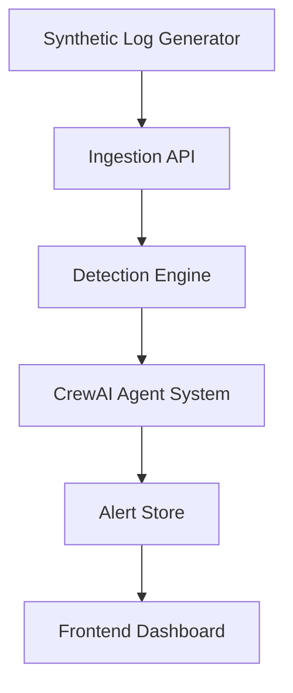

# Arxis SOC – Proof of Concept (POC) PRD

## Version
0.2 (POC / Demo with CrewAI Agents)

## Objective
Build a lightweight, fast POC of the Arxis SOC platform that demonstrates:
- Live synthetic log ingestion
- Real-time alert detection
- Multi-agent AI reasoning using CrewAI
- Human-readable explanations
- Analyst-facing dashboard

The goal is to **visually and conceptually demonstrate an agentic SOC**, not to build a full SIEM.

---

## Success Criteria (POC)
- Logs flow end-to-end in real time
- Alerts are produced and explained by agents
- Clear separation of responsibilities between agents
- Entire system runs locally
- Demo can be explained in under 5 minutes

---

## Non-Goals (Explicitly Out of Scope)
- No Kafka, Flink, or GPU usage
- No real ML model training
- No compliance submission
- No enterprise-scale performance

---

## High-Level Architecture (POC)



---

## Core Components

### 1. Synthetic Log Generator

**Purpose**
Simulate realistic SOC telemetry.

**Implementation**
- Python script (`log_generator.py`)
- Emits JSON logs every 1–3 seconds

**Log Types**
- Successful login
- Failed login
- Privilege escalation
- Data download
- Login from new geography

**Example Log**
```json
{
  "timestamp": "2026-01-20T12:01:22Z",
  "user": "john.doe@company.com",
  "event_type": "failed_login",
  "ip": "91.203.12.4",
  "location": "Russia",
  "asset": "customer-db"
}
```

---

### 2. Ingestion API

**Purpose**
Accept logs and push them into the system.

**Implementation**
- FastAPI (`ingestion_service.py`)
- Endpoint: `POST /logs`

**Responsibilities**
- Validate log schema
- Forward logs to detection engine

---

### 3. Detection Engine (Rules-Based)

**Purpose**
Simulate threat detection logic before agents reason.

**Implementation**
- Python module (`detection_engine.py`)
- Stateless rule evaluation

**Minimum Rules**
- `BRUTE_FORCE`: > 5 failed logins in 2 minutes
- `SUSPICIOUS_LOGIN`: Login from unseen country
- `INSIDER_THREAT`: Privilege escalation + data access

**Output**
```json
{
  "signal_type": "SUSPICIOUS_LOGIN",
  "user": "john.doe@company.com",
  "severity": "HIGH",
  "events": [...]
}
```

This output becomes **input to the CrewAI system**.

---

### 4. CrewAI Agent System (Core of the POC)

#### Overview
The SOC logic is modeled as **5 collaborating AI agents** using CrewAI. Each agent has a **single responsibility**, mimicking a real SOC workflow.

---

#### Agent 1: Ingestion Analyst Agent
- **Role**: Understands raw security signals.
- **Responsibilities**:
  - Review detection output
  - Confirm the signal is meaningful
  - Normalize alert context
- **Input**: Detection signal, raw events
- **Output**: Structured alert context

---

#### Agent 2: Threat Analyst Agent
- **Role**: Determine *what kind of threat this is*.
- **Responsibilities**:
  - Classify the alert (Credential Abuse, Insider Threat, etc.)
  - Assess severity justification
  - Identify suspicious patterns
- **Output**:
  ```json
  {
    "threat_type": "Credential Compromise",
    "confidence": "High"
  }
  ```

---

#### Agent 3: Context Enrichment Agent
- **Role**: Adds human-level context.
- **Responsibilities**:
  - Check historical behavior (synthetic)
  - Identify “first-time” actions
  - Add business-style reasoning
- **Example**:
  - “User has never logged in from this country before”
  - “Asset accessed contains sensitive data”

---

#### Agent 4: Explanation Agent
- **Role**: Translate analysis into human language.
- **Responsibilities**:
  - Generate a clear explanation
  - Explain *why* this matters
  - Recommend next steps
- **Example Output**:
  ```text
  The user logged in from Russia for the first time.
  This behavior deviates from their usual login pattern.
  Such anomalies often indicate compromised credentials.
  Recommended action: Verify user identity and reset credentials.
  ```

---

#### Agent 5: SOC Manager Agent
- **Role**: Final decision-maker.
- **Responsibilities**:
  - Decide alert priority
  - Approve alert for analyst visibility
  - Add urgency framing
- **Output**:
  ```json
  {
    "final_severity": "HIGH",
    "action": "IMMEDIATE_REVIEW"
  }
  ```

---

#### CrewAI Execution Model
- Agents run sequentially
- Shared memory context
- One alert = one agent workflow
- Failures gracefully fallback to rule-based output

---

### 5. Alert Store

**Purpose**
Persist finalized alerts for the UI.

**Implementation**
- SQLite or in-memory store

**Fields**
- `alert_id`
- `timestamp`
- `user`
- `threat_type`
- `severity`
- `explanation`
- `raw_events`

---

### 6. Backend API (Frontend Facing)

**Endpoints**
- `GET /alerts`
- `GET /alerts/{id}`
- `GET /metrics`

**Key Requirement**
- API must expose **agent-generated explanations**

---

### 7. Frontend (Lovable)

**Purpose**
Showcase agentic SOC behavior visually.

**Required Screens**
1. **Live Alert Feed**: Real-time updates, Severity badges.
2. **Alert Detail View**: Explanation text, “Generated by AI Agents” indicator, Event timeline.
3. **Agent Trace**: Show which agents contributed (e.g., Threat Analyst → Explanation Agent → SOC Manager).

---

## Demo Flow (Scripted)
1. Start log generator
2. Logs stream live
3. Detection fires
4. CrewAI agents process the alert
5. Alert appears with explanation
6. Click alert → show reasoning
7. Emphasize agent collaboration

---

## Tech Stack (POC)

| Layer | Tech |
| :--- | :--- |
| **Language** | Python 3.11 |
| **API** | FastAPI |
| **Agents** | CrewAI |
| **Storage** | SQLite |
| **Frontend** | Lovable |
| **Data** | Synthetic JSON |

---

## Suggested Repo Structure

```text
arxis-poc/
├── agents/             # CrewAI Agent definitions
│   ├── context_agent.py
│   ├── explanation_agent.py
│   ├── ingestion_agent.py
│   ├── soc_manager_agent.py
│   └── threat_agent.py
├── alerts.db           # SQLite database
├── api.py              # Main API entry point
├── crew_runner.py      # Orchestrates Agent execution
├── detection_engine.py # Rule-based detection logic
├── ingestion_service.py# Direct log ingestion API
└── log_generator.py    # Synthetic log producer
```

---

## Timeline (Fast POC)

| Day | Deliverable |
| :--- | :--- |
| **Day 1** | Logs + ingestion |
| **Day 2** | Detection rules |
| **Day 3** | CrewAI agents |
| **Day 4** | Frontend |
| **Day 5** | Demo polish |

---

## Key Pitch Lines
- “This is not alerting, this is reasoning.”
- “Each alert is a mini SOC team.”
- “Agents explain what junior analysts miss.”
- “Rules today, ML tomorrow — agents stay.”

---

## Risks & Mitigations

| Risk | Mitigation |
| :--- | :--- |
| **Technically simplistic** | Strong agent narrative + clean UI |
| **Accuracy concerns** | Clarify this is a Phase-0 reasoning POC |
